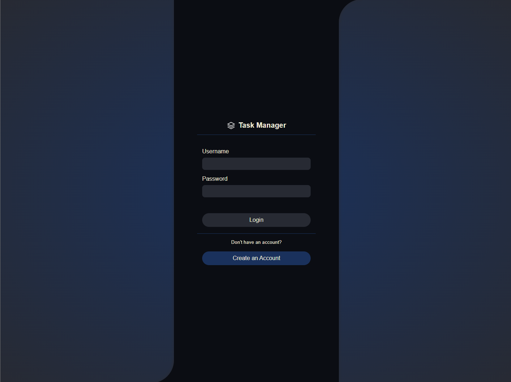
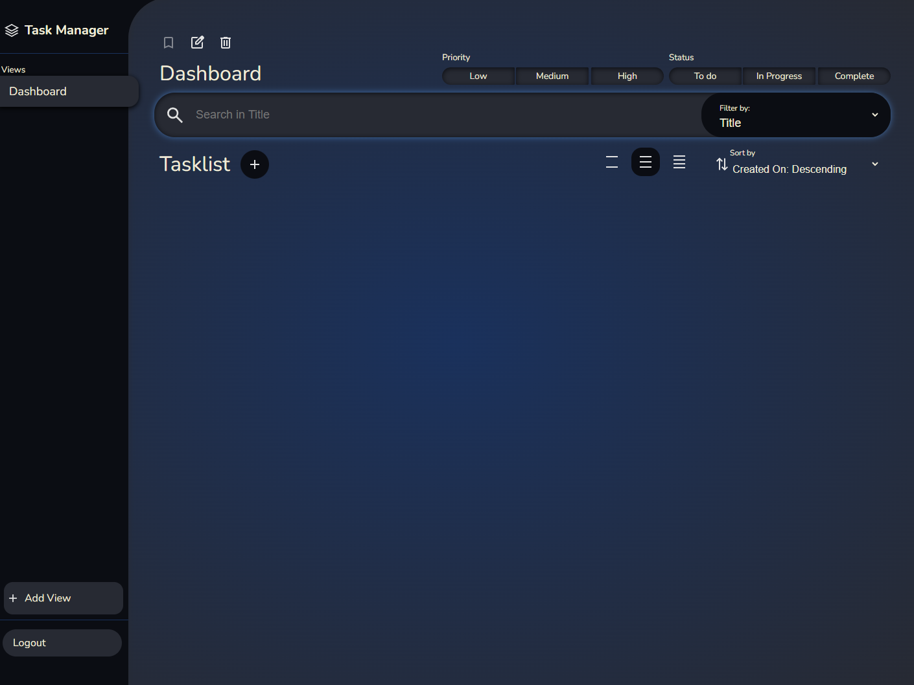
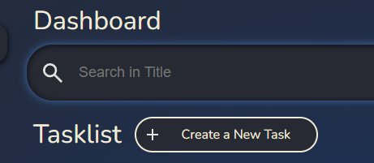
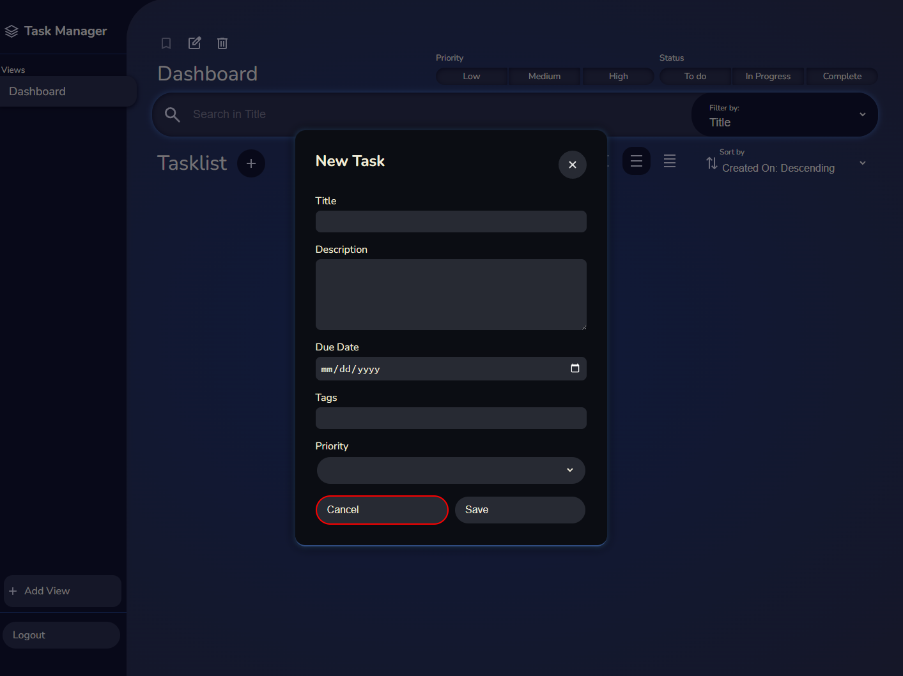
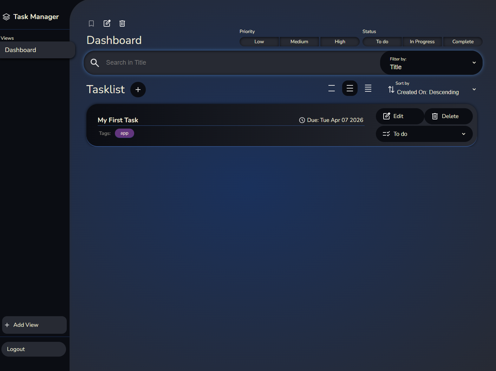
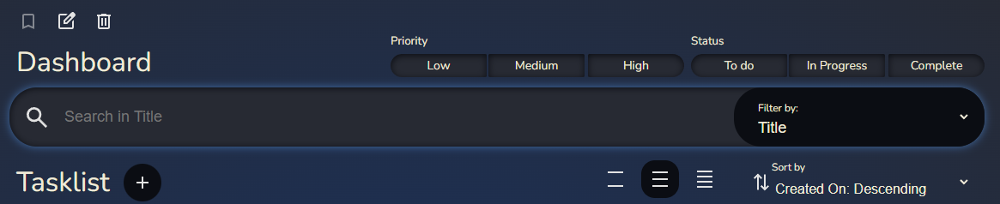
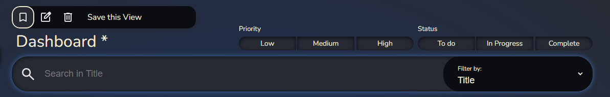
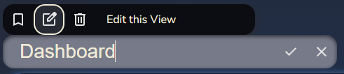

# DGL 104 - Task Management System (TMS)

<font size=5>Task Manager</font>

-----

*A tasklist displaying detailed task elements*

## Introduction
The Task Manager App provides users with a intuitive interface to create and manage simple tasks. Users can create, update, and delete tasks, and can group alike tasks or projects into different collections by saving specific filering and sorting preferences in a View. 

## Tech Stack
- HTML
- CSS
- Typescript
- IndexedDB

## Unique Features
- Create, View, Update, and Delete Tasks
- Track the progress of your tasks by setting the Task status to To Do, In Progress, or Complete
- Prioritize Tasks by setting the Task priority to Low, Medium, or High
- Add tags to each Task to easily find and filter Tasks belonging to certain projects
- Highlighting overdue tasks, tasks due today, and completed tasks to visually distinguish between them
- Sort Tasks according to various criteria (i.e. title, description, due date, etc.)
- Filter Tasks according to their Status, Priority, and a unique filter value provided in the Search Bar
- Create accounts and login to view and manage separate task lists 

## Design Patterns

### Singleton Pattern
The Task Manager App uses the Singleton Pattern to facilitate access to the database. Each ui class (for example, [tasks.ts](src/tasks/tasks.ts)) caches a reference to a singleton Service class ([TaskService.ts](src/tasks/TaskService.ts)) which communicates with a Repository class ([TaskRepository](src/tasks/TaskRepository.ts)) which connects to the database.

The Service classes imlement the Singleton pattern by defining a private static _instance variable and a public get Instance parameter. When the Instance parameter is first called, a new instance of the class is created and cached in the _instance member. Subsequent calls to service.Instance will return the cached _instance rather than constructing a new one. 

```typescript
private static _instance: TaskService;

static get Instance(): TaskService { 
    if (TaskService._instance == null) TaskService._instance = new TaskService();
    return TaskService._instance;
}
```

All Service classes implement this pattern. The [ViewHolder](src/views/ViewHolder.ts) also implements this pattern to make the current View and Viewlist easily accessible to the [views.ts](src/views/views.ts) and [tasks.ts](src/tasks/tasks.ts) ui scripts.

### Observer Pattern
The [ViewHolder](src/views/ViewHolder.ts) class implements the Observer Pattern to notify the [views.ts](src/views/views.ts) and [tasks.ts](src/tasks/tasks.ts) ui scripts when the current View has changed. This allows the views ui to update and highlight the current view in the sidebar, and allows the tasklist ui to update and filter the current tasklist according to the values specified in the view.

The Observer Pattern is implemented through the use of an [IObservable](src/interfaces/Observable.ts) interface and behaviours are defined in an abstract [Observerable](src/interfaces/Observable.ts) superclass.

```typescript
export interface IObservable<E> {
    _observers: ((event: E) => void)[];
    subscribe(callback: (event: E) => void): void;
    unsubscribe(callback: (event: E) => void): void;
    notify(event: E): void;
}

export abstract class Observable<E> implements IObservable<E> {
    _observers: ((event: E) => void)[] = [];

    subscribe(callback: (event: E) => void): void {
        this._observers.push(callback);
    }

    unsubscribe(callback: (event: E) => void): void {
        const index = this._observers.indexOf(callback);
        if (index >= 0) this._observers.splice(index, 1);
    }

    notify(event: E): void {
        for(let fun of this._observers) fun(event);
    }
}
```

I wanted to create IObservable as an interface first to allow subclasses to implement it, but defined the functionality in an abstract class as well so other classes without a superclass can inherit the functionality without any need to rewrite or copy the code.

The Observable class holds a list of observer functions which take a generic parameter of type E as an argument. If another class wants to subscribe to the Observable, the class can define ```function foo(bar: E): void``` and pass the function in as an argument to the Observable's subscribe method. When the Observable is updated, the notify event is called which invokes the observer functions.

### Factory Pattern
The Factory Pattern is used in the [TaskElementFactory](src/task_elements/TaskElementFactory.ts) to create different subclasses of TaskElement according to the currenttly defined TaskDisplayType. The TaskElementFactory is created in the tasks.ts ui script, and any time one of the display buttons is pressed, the value of the factory's _type field is set to the chosen display type (Compact, Basic, or Detailed). When taskFactory.create() is called, the method will return a TaskElement class of according to the chosen display type.

```typescript
public create(task: Task): TaskElement {
    let newElement: TaskElement;
    switch (this._type) {
        case TaskDisplayType.Detailed: 
            newElement = new DetailedTaskElement(task); break;   
        case TaskDisplayType.Compact: 
            newElement = new CompactTaskElement(task); break;   
        default: newElement = new BasicTaskElement(task)        
    }

    newElement.onEdit = this._onEdit;
    newElement.onDelete = this._onDelete;
    newElement.onSetStatus = this._onChangeStatus;
    
    // . . . ///

    return newElement;
}
```

With this implementation, different TaskElements can be easily created for in the factory and passed back to the UI for display.


*A Compact Task Element*


*A Basic Task Element*


*A Detailed Task Element*


----

### Decorator Pattern
The Task Factory also utilizes a decorators to further alter the task elements by assigning certain css classes depending upon various criteria. A task which is overdue (i.e. has a due date earlier than today) will be passed into the constructor of an OverdueTask decorator which will alter the tasks HTMLElement to highlight it in red in the task list. 

Similar decorators are used for tasks which are due today (highlighted in orange) and compelted tasks (highlighted in green).


*An overdue, completed, due today, and normal task from top to bottom*

## Installation Guidelines
This app can be accessed live at the following link: https://offerhallj.github.io/TaskManagerApp/index.html

To install a local version, simply download or clone the respository and open index.html in a browser. 

## Summary of the Project
The Task Manager app provides users with a intuitive interface to create and manage simple tasks. 

The app has 3 primary functions:
- Creating accounts and logging in
- Creating, viewing, editing, and deleting tasks
- Organizing and filtering tasks, saving organization and filtering options as Views, and switching between, editing, and deleting views

### Creating Accounts and Logging In

*The login page*

If a user is not currently logged into the app, any attempt to access the app's main page will be redirected to the login page. From here, users can enter their credentials to login, or click the Create an Account button to create a new user account. Once the account is created, the user will automatically be logged in.

**Note that each account must have a unique username and email address provided.**

### Creating, Viewing, Editing, and Deleting Tasks

*An empty dashboard*

When the user first creates an account, they will be met with an empty Dashboard. This Dashboard is the user's first View (which will be discussed in more depth later.)

To add a task, the user must click the "+" icon beside the Tasklist header.



*The "+" button will expand when hovered over*

#### The Taskform



After clicking the "+" button, the Task Form will appear. User can create a new task by entering the required information and clicking the save button. Users can exit the Task Form without saving by presing the X or Cancel buttons.

**Note: All fields on the Task Form are required except for the Tags field. If the user does choose to include tags, tags should be seperated with a comma.**

#### Editing and Deleting Tasks



Once the task has been saved, it will be visible on the user's Task List (provided no filtration settings filter it out.) With the task now visible in the list, user's can use the Action Buttons to the right of the task details to perform additional actions.

The Edit button will reopen the Task Form with the details of the current task pre-populated in the input fields. Users can alter the details and press Save to update the task, or press the X or Cancel buttons to cancel the edit.

The Delete button will remove the task from the tasklist.

The Status Dropdown (labeled To do in the screenshot above) will allow the user to quickly change the status of the Task. 

### Sorting and Filtering Tasks


Above the Tasklist, users can find the View's sorting and filtration options.

At the top are the Priority and Status filters. Clicking any of these options will filter out any tasks in the Tasklist which have the selected priority or status. For example, clicking "Complete" will remove any Tasks marked as "Complete" from the Tasklist; clicking "Low" will remove any Tasks with a priority set to Low from the Tasklist.

Below the Priority and status options is the Searchbar. Users can select which task detail they wish to filter from the dropdown list to the right of the searchbar, and can type into the searchbar to filter out all tasks from the Tasklist which *do not* contain the entered value in the chosen field. For example, if the user chooses to filter by Tags and enters "homework" into the searchbar, any task which *does not* have a tag containing the word "homework" will be removed from the Tasklist.

**Note: Tasks filtered out of the Tasklist are not deleted, they are simply not visible while the filtration options are applied. To see all tasks which the user has created, simply set all filtration options to their default state.**

The order in which tasks appear in the Tasklist can be set using the "Sort by" dropdown option below the Searchbar.

#### Viewing Task Details
By default, all tasks added to the Tasklist are displayed in Basic format. User can alter the display of the tasks by clickin one of the three buttons to the left of the "Sort by" dropdown menu. The farthest button to the left will display all task elements as *compact,* the center button will display them as *basic,* and the right-most button will display them as *detailed.*

*A Compact Task Element*


*A Basic Task Element*


*A Detailed Task Element*


### Saving, Editing, and Creating Views

Any change made to the sorting, filtering, or display settings in the current view will be undone when the page is reloaded. To make those changes permanent, the View must be saved. In the top-left of the screen, the user will see an asterisk (*) next to the View's title if changes have been made which need to be saved. Users can click the "Save this View" button above the view title to save any pending changes to the view. Once saved, these changes will be applied every time the view is loaded.



If the user wishes to change the name of the current view, users can click on the "Edit this View" options to the right of the save option. Clicking this button will convert the View title into a text field which the user can type a new name into. Once the user has entered their desired name, they can click the checkmark button to save the change. If the uses wishes to cancel the change, the can click the X button.

To add a new View to the app, users can click the "+ Add View" button in the bottom corner of the View list. Doing so will create a new view with the current filtering, sorting, and display options already applied.

If the user created a view by mistake, or simply wishes to clean up the View list, they can select the View from the list and click the Delete this View button above the View Title to remove the View from the app.

## Contrubutions
This project was created entirely by Jared Hall for DGL-104 at North Island College.

## References
The following posts on StackOverFlow were referenced in the creation of this app:

https://stackoverflow.com/questions/2781549/removing-input-background-colour-for-chrome-autocomplete

This post was used in [styles.css](docs/styles/styles.css) to remove the detaulf auto-fill background color from the text input fields when an option is selected from the auto-fill dropdown.

---
https://blog.logrocket.com/using-indexeddb-complete-guide/

This article was referenced extensively in the creation of the repository classes to create and access data from IndexedDB 

---
https://stackoverflow.com/questions/75953640/how-to-get-event-target-result-in-javascript-indexdb-typescript-working

This post was used to figure out how to access the 'result' field from the EventTarget in the "upgradeneeded" event listener in the repository

---
https://stackoverflow.com/questions/503093/how-do-i-redirect-to-another-webpage

This post was used for the redirect code in [validatelogin.ts](src/login/validateLogin.ts) and elsewhere.

---
https://stackoverflow.com/questions/2998784/how-to-output-numbers-with-leading-zeros-in-javascript

I referenced this post to see how to add leading zeros to the date strings

---
https://medium.com/@kamresh485/a-comprehensive-guide-to-cursors-in-indexeddb-navigating-and-manipulating-data-with-ease-2793a2e01ba3

I referenced this article to get started with implementing cursors in the IndexedDB repositories

---
https://copilot.microsoft.com/shares/uyZawt3i8e5dBe4neqFcv

I used copilot to help resolve an issue with the methods being dropped from my Task class after trying to cast the result of a repository call as a Task (ie: ```let task: Task = cursor.value as Task```).

Copilot explained that the result was just a dataobject with fields which matched the Task class but which wasn't actually an instance of the class. Ultimately, I ended up just feeding the values from the database into the constructor of the class to manually construct the instance.

---
https://stackoverflow.com/questions/11217309/how-do-i-update-data-in-indexeddb

This post was used to help me set up the update methods in the repository classes/

--- 
https://blog.logrocket.com/iterate-over-enums-typescript/

This article was used to see how to iterate over the values of an enum

---
https://stackoverflow.com/questions/43837659/guid-uuid-in-typescript-node-js-app

This post was referenced to figure out how to create a UUId for the login authentication token created in [UserRepository](src/user/UserRepository.ts)

---
https://stackoverflow.com/questions/41769955/initialize-a-map-containing-arrays-in-typescript

This post was used to create a Map with initial values in [View.ts](src/views/View.ts).